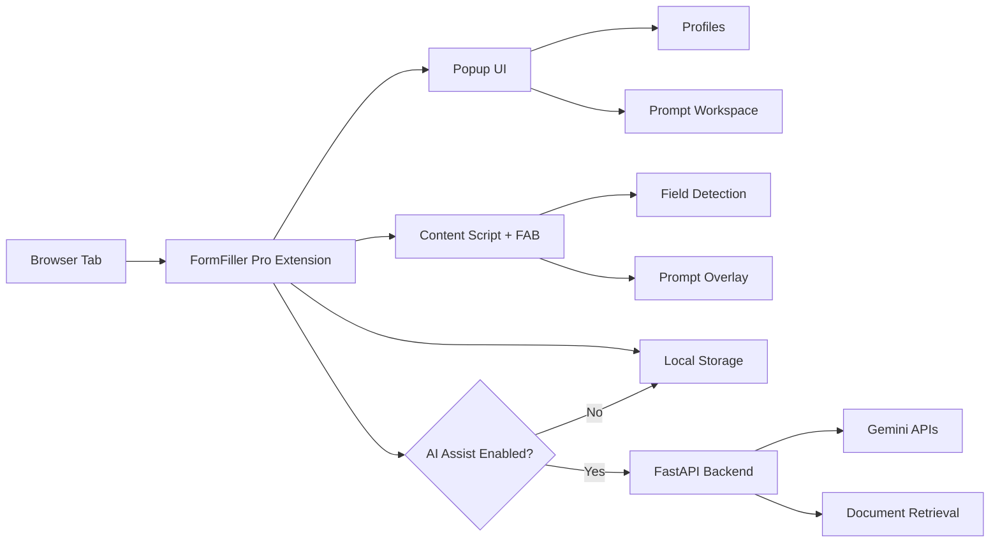
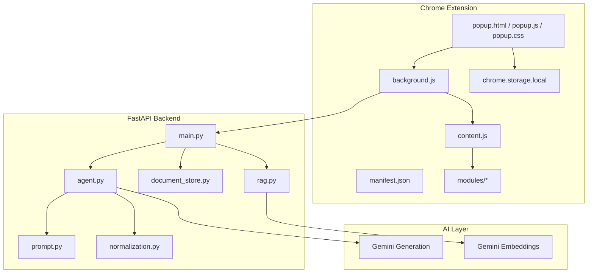
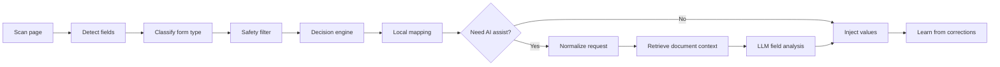
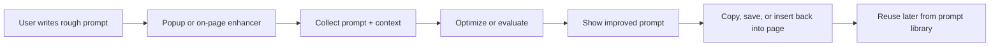
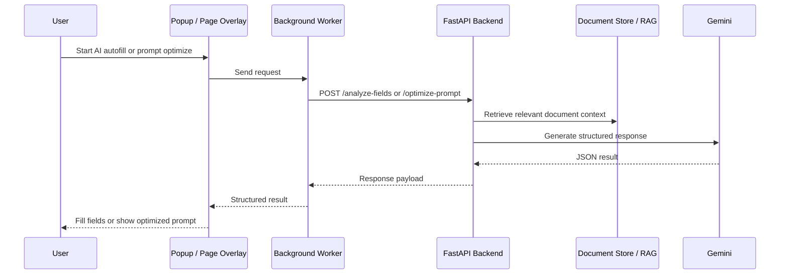
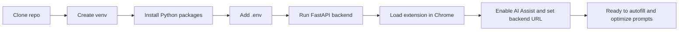
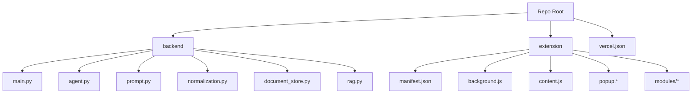
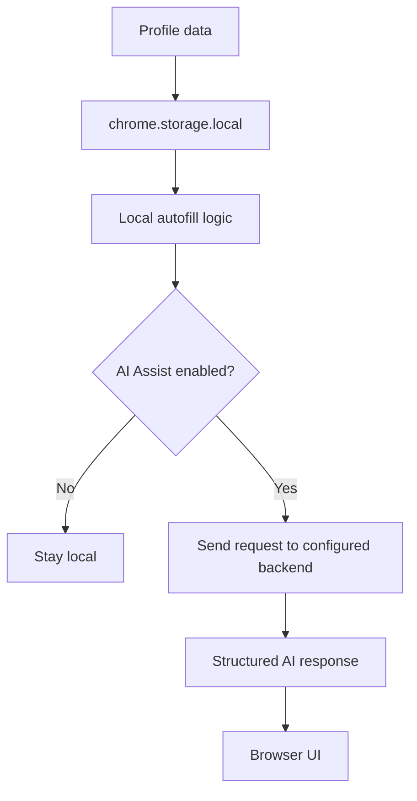
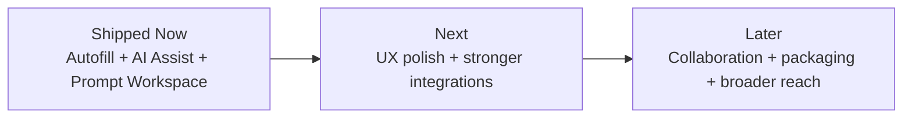
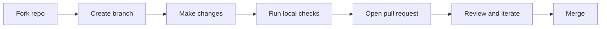

# FormFiller Pro

<p align="center">
  <strong>Privacy-first Chrome extension for smart form autofill, prompt optimization, and reusable AI workflows.</strong>
</p>

<p align="center">
  Fill forms faster, keep sensitive data local, and improve prompts directly inside the tools you already use.
</p>

<p align="center">
  <a href="https://github.com/NikhilMurugesan/FormFiller/stargazers">
    
  </a>
  <a href="https://github.com/NikhilMurugesan/FormFiller/network/members">
    
  </a>
  <a href="https://github.com/NikhilMurugesan/FormFiller/issues">
    
  </a>
  <a href="https://github.com/NikhilMurugesan/FormFiller/pulls">
    
  </a>
  <a href="https://github.com/NikhilMurugesan/FormFiller/commits/main">
    
  </a>
  
</p>

<p align="center">
  <a href="#quick-start"><strong>Quick Start</strong></a>
  |
  <a href="#features"><strong>Features</strong></a>
  |
  <a href="#installation"><strong>Installation</strong></a>
  |
  <a href="#usage"><strong>Usage</strong></a>
  |
  <a href="#contributing"><strong>Contributing</strong></a>
</p>

> If this project saves you time, give it a star. It helps more people discover it, try it, and contribute to it.

## Tagline

**Stop retyping forms. Stop reworking prompts. Keep both workflows fast, local, and under your control.**

## Why This Matters

Most browser autofill tools are too shallow for real-world forms, and most prompt tools force you to leave your workflow just to rewrite text you were already typing.

FormFiller Pro exists to solve both problems in one place:

- **For forms:** it detects fields, maps them to profile data, blocks sensitive inputs, remembers your corrections, and can use AI only when needed.
- **For prompts:** it helps you optimize, evaluate, save, and reuse prompts from the popup or directly on the page.

The result is simple: **less repetition, fewer mistakes, better outputs, and more confidence in what gets filled or sent.**

<p align="center">
  
</p>

## Why You'll Love It

| What you get | Why it matters |
| --- | --- |
| **Local-first profile storage** | Your autofill data stays in `chrome.storage.local` unless you explicitly enable AI Assist. |
| **Sensitive-field safety filters** | Passwords, OTPs, payment fields, SSNs, IDs, and consent checkboxes are guarded by design. |
| **Multi-profile autofill** | Switch between personal, work, and job-application profiles without rewriting the same data. |
| **Prompt workspace built in** | Optimize, evaluate, save, and reapply prompts without opening another app. |
| **On-page prompt enhancement** | Improve prompts inside ChatGPT and similar workflows instead of bouncing between tabs. |
| **AI when needed, not by default** | Deterministic matching handles simple cases locally; the backend helps with harder ones. |
| **Context-aware document support** | Upload a PDF or DOCX and retrieve relevant chunks for better AI-assisted field analysis. |
| **Learned memory and domain mapping** | The extension gets better over time on recurring forms and repeated selections. |

## Product Preview

<table>
  <tr>
    <td align="center">
      <br>
      <strong>Home</strong><br>
      Scan forms, autofill fast, and attach a context document.
    </td>
    <td align="center">
      <br>
      <strong>Profiles</strong><br>
      Switch between Personal, Work, and Job Application data.
    </td>
  </tr>
  <tr>
    <td align="center">
      <br>
      <strong>Settings</strong><br>
      Control AI Assist, shortcuts, and local-first behavior.
    </td>
    <td align="center">
      <br>
      <strong>Privacy + Memory</strong><br>
      Inspect learned memory, domain mappings, and privacy guarantees.
    </td>
  </tr>
</table>

These screenshots show the current extension UI as it exists in the repo today.

## Table of Contents

- [What It Does](#what-it-does)
- [Architecture](#architecture)
- [Features](#features)
- [Who It's For](#who-its-for)
- [Use Cases](#use-cases)
- [Why It's Different](#why-its-different)
- [Installation](#installation)
- [Quick Start](#quick-start)
- [Usage](#usage)
- [API Overview](#api-overview)
- [Project Structure](#project-structure)
- [Project Status](#project-status)
- [Privacy and Security](#privacy-and-security)
- [Roadmap](#roadmap)
- [Contributing](#contributing)
- [FAQ](#faq)
- [Support This Project](#support-this-project)
- [License](#license)

## What It Does

FormFiller Pro is a **Chrome extension + FastAPI backend** that combines:

- **Smart form autofill**
- **Optional AI-assisted field matching**
- **Context-document retrieval**
- **Prompt optimization and prompt evaluation**
- **Context memory and prompt library**
- **On-page prompt enhancement inside AI tools**

It is designed for people who fill repetitive forms, work across multiple profiles, and use AI often enough to care about prompt quality and speed.



This is the core shape of the product: the extension handles local workflows first, and the backend only participates when AI Assist or prompt APIs are used.

## Architecture

### High-Level System View



The repo is intentionally split so the **browser experience stays fast and local**, while the backend handles heavier AI tasks and document retrieval.

### Autofill Pipeline



This is where the project earns trust: it does not jump straight to AI. It uses deterministic logic first, then escalates only when the field is genuinely ambiguous.

### Prompt Workflow



The prompt assistant is built for real workflows: capture, improve, reuse, and keep moving.

### Request / Response Sequence



The backend is designed to return structured JSON so the extension can stay predictable and explainable.

## Features

### 1. Smart Form Autofill

**What it does**  
Detects fields on the current page, classifies the form, matches fields to profile data, and injects values with confidence-aware logic.

**Why it matters**  
Basic browser autofill breaks on custom forms, inconsistent labels, and multi-step applications.

**How it helps**  
You spend less time correcting obvious fields manually and more time reviewing edge cases that actually need attention.

### 2. Multi-Profile Support

**What it does**  
Lets you switch between profiles like Personal, Work, and Job Application directly from the popup.

**Why it matters**  
One browser profile rarely fits every workflow.

**How it helps**  
You can move between personal forms, client forms, and job applications without rewriting or re-importing data every time.

### 3. Privacy-First Local Storage

**What it does**  
Stores profile data, learned memory, prompt history, prompt contexts, and settings in the browser.

**Why it matters**  
Autofill tools often feel risky because users do not know where data is going.

**How it helps**  
The extension remains useful even without the backend, and AI Assist stays an explicit opt-in instead of a hidden dependency.

### 4. Safety Filters for Sensitive Fields

**What it does**  
Blocks passwords, OTPs, PINs, SSNs, national IDs, payment fields, CAPTCHA inputs, and consent-related checkboxes from being auto-filled or auto-checked.

**Why it matters**  
Speed is useful only if it does not create risk.

**How it helps**  
You can trust the tool more because it knows when not to act.

### 5. Learned Memory and Domain Mappings

**What it does**  
Remembers useful selections and domain-specific mappings, then reuses them on future visits.

**Why it matters**  
Many forms are not globally consistent, but they are consistent enough within one site.

**How it helps**  
The extension becomes more accurate over time on recurring websites and repeated application flows.

### 6. AI Assist for Hard Fields

**What it does**  
Sends normalized field context to a FastAPI backend for structured AI analysis when deterministic matching is not enough.

**Why it matters**  
Custom labels, vague placeholders, and dynamic forms often need deeper reasoning than a static mapping table can provide.

**How it helps**  
You get better suggestions on ambiguous fields without turning every fill action into a remote AI call.

### 7. Context Document Upload and Retrieval

**What it does**  
Uploads a PDF or DOCX, chunks the content, creates embeddings, and retrieves only the most relevant snippets during AI-assisted field analysis.

**Why it matters**  
Resumes, application documents, and supporting context are often the source of truth for hard-to-fill fields.

**How it helps**  
The model gets relevant context without rereading the entire document every time.

### 8. Prompt Optimizer and Evaluator

**What it does**  
Improves rough prompts, evaluates prompt quality, returns concise explanations, and keeps output compatible across ChatGPT, Claude, Gemini, and Copilot style workflows.

**Why it matters**  
Most users waste time rewriting prompts through trial and error.

**How it helps**  
You get clearer prompts faster and learn what makes a prompt work.

### 9. Context Memory and Prompt Library

**What it does**  
Stores reusable prompt context, saved prompts, tags, and prompt history in the extension.

**Why it matters**  
Good prompts disappear quickly in chat tools.

**How it helps**  
You can build a repeatable prompt workflow instead of starting from scratch each time.

### 10. On-Page Prompt Enhancement

**What it does**  
Adds a prompt enhancement experience inside the page, including a floating action button and a ChatGPT-focused prompt enhancer flow.

**Why it matters**  
Switching tabs to improve a prompt breaks momentum.

**How it helps**  
You can optimize or evaluate prompts where you are already working.

## Who It's For

- **Job seekers** who fill repeated applications and want profile-aware autofill
- **Consultants and operators** who reuse the same information across portals
- **Power users** who work in forms and browser tools all day
- **AI-heavy users** who want prompt refinement without leaving ChatGPT-style workflows
- **Builders and contributors** interested in Chrome extensions, FastAPI, browser automation, and structured AI systems

## Use Cases

### Job Applications

- Reuse your experience, links, education, and summary across repeated application portals
- Upload a resume for better AI-assisted field suggestions
- Keep sensitive fields blocked automatically

### Repetitive Admin Work

- Fill contact forms, registration forms, client intake flows, and profile update pages
- Save time on fields that look different but mean the same thing

### Prompt Engineering in Real Workflows

- Clean up rough prompts before sending them
- Reuse brand voice, constraints, and context notes
- Save prompts that worked and reapply them later

### Domain-Specific Repetition

- Improve accuracy on recurring websites through learned mappings
- Reuse previous site-specific behavior instead of remapping the same fields every visit

## Why It's Different

| FormFiller Pro | Typical autofill extension | Typical prompt tool |
| --- | --- | --- |
| Local-first data model | Often opaque | Usually not relevant |
| Sensitive-field blocking | Often partial | Not a focus |
| Multi-profile workflows | Sometimes basic | Rare |
| Learned domain memory | Rare | Not applicable |
| Optional AI assist | Usually all-or-nothing | Usually AI-only |
| Prompt workspace in the same extension | Rare | Yes |
| On-page AI prompt enhancement | Rare | Sometimes |
| Context-document retrieval | Rare | Sometimes |

FormFiller Pro is different because it treats **autofill accuracy, safety, and prompt quality as one browser productivity layer**, not as disconnected tools.

## Design Philosophy

- **Local first**: default to browser storage and deterministic logic
- **AI by exception**: use AI when it adds value, not as a crutch
- **Safety before convenience**: sensitive and consent-related fields are protected
- **Explainability matters**: confidence, reasoning, and structured outputs reduce blind trust
- **Workflow over novelty**: the best feature is the one that saves time without changing how people already work

## Installation

### Prerequisites

- Chrome or any Chromium-based browser
- Python `3.10+` recommended
- A Google Gemini API key if you want AI Assist or prompt APIs

### 1. Clone the repository

```bash
git clone https://github.com/NikhilMurugesan/FormFiller.git
cd FormFiller
```

### 2. Set up the backend

Create a virtual environment and install the Python dependencies used in this repo:

```bash
python -m venv .venv
```

PowerShell:

```powershell
.venv\Scripts\Activate.ps1
pip install fastapi uvicorn python-dotenv google-genai PyPDF2 python-docx numpy "pydantic>=2"
```

macOS / Linux:

```bash
source .venv/bin/activate
pip install fastapi uvicorn python-dotenv google-genai PyPDF2 python-docx numpy "pydantic>=2"
```

Create a `.env` file in the project root:

```env
GOOGLE_API_KEY=your_google_gemini_api_key
DEFAULT_MODEL=gemini-3-flash-preview
```

Start the backend:

```bash
python -m uvicorn backend.main:app --reload --port 8000
```

### 3. Load the extension

1. Open `chrome://extensions`
2. Enable **Developer mode**
3. Click **Load unpacked**
4. Select the `extension/` folder

### 4. Connect the extension to your local backend

Open the extension popup, go to **Settings**, enable **AI Assist**, and set the backend URL to:

```text
http://localhost:8000
```

### Setup Flow



This keeps onboarding straightforward: backend first, extension second, AI optional but easy to enable.

## Quick Start

### Autofill in under 2 minutes

1. Open the extension popup
2. Create or edit your active profile
3. Visit a form page
4. Click **Autofill All Fields** or use `Alt + Shift + F`
5. Review low-confidence fields before submitting

### Prompt optimization in under 2 minutes

1. Open the **Prompts** tab
2. Paste a rough prompt into **Source Prompt**
3. Add optional project context
4. Click **Optimize**
5. Copy, save, or insert the improved prompt back into the page

## Usage

### Common Workflow: Smart Autofill

```text
Open a form -> Scan -> Review -> Autofill -> Adjust edge cases -> Save corrections
```

### Common Workflow: AI-Assisted Fill with Resume Context

1. Upload your PDF or DOCX in **Context Document**
2. Enable **AI Assist**
3. Scan or run **AI Autofill**
4. Let the backend use relevant document chunks for ambiguous fields

### Common Workflow: Prompt Cleanup

Example rough prompt:

```text
make this landing page copy better for founders and keep it simple
```

Example optimized prompt:

```text
Rewrite this landing page copy for startup founders. Keep the tone clear, modern, and trustworthy. Focus on value, speed, and ease of use. Remove fluff and make the headline and supporting copy more persuasive without sounding overly salesy.
```

### Common Workflow: On-Page Prompt Enhancement

1. Focus a text box or use selected text
2. Open the floating action button or inline enhancer
3. Run **Optimize Prompt**
4. Insert the improved version back into the active input

### Common Workflow: Reuse Prompt Context

- Save brand voice once in **Context Memory**
- Select it again when writing new prompts
- Keep results more consistent across tools and sessions

## API Overview

The backend currently exposes these endpoints:

| Endpoint | Method | Purpose |
| --- | --- | --- |
| `/` | `GET` | Health check |
| `/document-status` | `GET` | Check whether a document is cached for a session |
| `/upload-document` | `POST` | Upload and embed a PDF or DOCX |
| `/analyze-fields` | `POST` | Analyze ambiguous form fields |
| `/optimize-prompt` | `POST` | Optimize a prompt |
| `/evaluate-prompt` | `POST` | Evaluate prompt quality |
| `/clear-storage` | `DELETE` | Clear cached backend storage |

### Example: Optimize a prompt

```bash
curl -X POST http://localhost:8000/optimize-prompt \
  -H "Content-Type: application/json" \
  -d '{
    "source_prompt": "make this travel prompt better",
    "project_context": "Travel planning assistant for budget-conscious users",
    "target_models": ["ChatGPT", "Claude", "Gemini", "Copilot"],
    "preserve_intent": true
  }'
```

### Example: Evaluate a prompt

```bash
curl -X POST http://localhost:8000/evaluate-prompt \
  -H "Content-Type: application/json" \
  -d '{
    "prompt": "Create a launch plan for my product",
    "project_context": "B2B SaaS launch for a small team",
    "target_models": ["ChatGPT", "Claude", "Gemini", "Copilot"]
  }'
```

## Project Structure

```text
FormFiller/
|-- backend/
|   |-- main.py
|   |-- agent.py
|   |-- prompt.py
|   |-- normalization.py
|   |-- contracts.py
|   |-- document_store.py
|   |-- rag.py
|   `-- user_data.py
|-- extension/
|   |-- manifest.json
|   |-- background.js
|   |-- content.js
|   |-- popup.html
|   |-- popup.css
|   |-- popup.js
|   |-- modules/
|   `-- assets/
`-- vercel.json
```



The repository is easy to navigate: browser code in `extension/`, AI and normalization logic in `backend/`.

## Project Status

**Status: active development**

What is already here:

- Working Chrome extension with popup, profiles, scanning, and autofill
- Sensitive-field safety filtering
- Learned memory and domain mapping
- Optional FastAPI backend for AI-assisted fill
- Prompt optimizer, evaluator, context memory, and prompt library
- On-page prompt panel and ChatGPT-focused prompt enhancement flow

What this means:

- The project is already useful
- The UX is cohesive enough to try now
- The feature surface is still evolving, which makes contributions especially valuable

## Privacy and Security

FormFiller Pro is built around a practical privacy model:

- Profile data is stored in **`chrome.storage.local`**
- AI Assist is **off by default**
- Sensitive fields are blocked from autofill
- Consent-style checkboxes are treated carefully
- Prompt workflows can be used locally, with backend features enabled explicitly
- Document context is chunked and cached in backend memory by session

### Privacy Model



This split is important: the product still works without remote AI, and the user stays in control of when remote processing happens.

## Problems It Solves

- Repetitive form filling across inconsistent websites
- Low trust in unsafe autofill behavior
- Hard-to-map custom fields in job portals and long forms
- Prompt trial-and-error inside AI tools
- Lost prompts, repeated context, and inconsistent prompt quality

## Roadmap

### Current Focus

- Tighten prompt workflows across popup and on-page enhancer
- Improve confidence review and explainability
- Expand domain-specific learning and better recurring-site accuracy

### Planned Next

- Better prompt workflow polish across more AI sites
- Stronger import/export and portability for profiles and prompt assets
- More robust backend packaging and deployment ergonomics

### Future Vision

- Sharper collaboration and sharing primitives
- Broader browser compatibility and distribution
- More advanced review tooling for both forms and prompts



The roadmap is focused on compounding reliability and workflow value, not adding random surface area.

## Contributing

Contributions are welcome, especially if you care about:

- Chrome extensions
- browser automation
- prompt tooling
- structured AI output
- FastAPI backends
- privacy-first productivity tools

### Ways to contribute

- Report a bug with a reproducible example
- Suggest a feature that improves real workflows
- Improve documentation, onboarding, or examples
- Submit fixes for extension UX, backend logic, or prompt workflows
- Add tests, packaging improvements, or deployment helpers

### Contribution Flow



### Recommended contribution steps

```bash
git clone https://github.com/NikhilMurugesan/FormFiller.git
cd FormFiller
git checkout -b feat/your-change
```

Then:

1. Make the change
2. Test the extension and backend locally
3. Open a pull request with a clear description and screenshots or repro steps if relevant

If you are a first-time contributor, documentation, UI polish, bug reports, and small workflow improvements are all excellent places to start.

## FAQ

### Does this work without the backend?

Yes. Core profile management, local storage, scanning, and deterministic autofill work without the backend. AI Assist and prompt APIs require the backend.

### Is my profile data sent to a server automatically?

No. The extension stores profile data locally. Requests are only sent to the configured backend when you explicitly enable AI Assist or use prompt/backend features that depend on it.

### What browsers are supported?

The current implementation targets **Chrome / Chromium-based browsers** through Manifest V3.

### What kinds of fields are blocked for safety?

Passwords, OTPs, PINs, CVV fields, payment fields, SSNs, national IDs, CAPTCHA-like fields, and consent-style checkboxes are all treated carefully by the safety layer.

### Can I use my own backend?

Yes. The extension settings let you point AI Assist to a custom backend URL.

### What AI model does it use?

The backend is currently wired around **Google Gemini APIs** for generation and embeddings.

### Does it support prompt workflows only for ChatGPT?

No. The prompt workspace is model-agnostic in design and supports target models like ChatGPT, Claude, Gemini, and Copilot. The current on-page enhancer work includes ChatGPT-focused integration.

## Support This Project

If you want to help this project grow:

- **Star the repo**
- Share it with developers, job seekers, browser productivity fans, and prompt-heavy users
- Open issues with real-world edge cases
- Contribute code, docs, or UX improvements

<p>
  <a href="https://github.com/NikhilMurugesan/FormFiller/stargazers">
    <strong>Star this repo on GitHub</strong>
  </a>
</p>

If you plan to publish this more broadly, add:

- a demo GIF
- a Chrome Web Store link
- a real license
- a screenshot-rich `docs/` folder

Those four additions will materially improve trust and conversion for GitHub visitors.

## License

**Replace this section with your actual license once you add a `LICENSE` file.**

Suggested example:

```text
MIT License
```

---

Built for people who want their browser to do more useful work with less friction and more control.
